# AI-Powered Land Acquisition Delay Prediction & Decision Support System
### Smart India Hackathon (SIH) — National Prototype
**Theme:** Infrastructure, Smart Governance & Predictive Public Administration  
**Prototype Data Disclosure:** *Synthetic Prototype Dataset for Demonstration & Evaluation (Zero Confidential Government Records)*

---

## Executive Summary

Linear infrastructure mega-projects (highways, railway corridors, power transmission grids, industrial corridors, and urban transit) frequently suffer from **land acquisition delays** that result in cost overruns amounting to thousands of crores and multi-year project stalls. 

Traditionally, state revenue departments and implementing agencies (such as NHAI, MoRTH, and State PWDs) manage land acquisition reactively — tracking bottlenecks only after statutory milestones are missed.

This platform shifts land acquisition governance from **reactive monitoring** to **proactive, AI-powered decision support**:
1. **Predictive Risk Engine:** Continuously estimates delay probabilities and calibrates a composite **0–100 Risk Score** (Categorized into `LOW`, `MEDIUM`, `HIGH`, and `CRITICAL`).
2. **Dual-Model ML Architecture:** Concurrently predicts **binary delay likelihood** (classification) and **expected delay in days** (regression).
3. **Bidirectional Explainable AI (XAI):** Deploys tree-based **SHAP (SHapley Additive exPlanations)** to pinpoint both **risk-increasing bottlenecks** and **protective risk-mitigating factors** in plain administrative English and technical diagnostics.
4. **Structured 5-Attribute Action Engine:** Translates raw ML probabilities into actionable administrative interventions with designated owning departments, priorities, and SLA timelines.
5. **Interactive What-If Scenario Simulator:** Allows project directors to test intervention policies (e.g., doubling survey surveyors, boosting compensation disbursement rates) and inspect real-time delta reductions in risk and delay days.
6. **Full-Coverage GIS Risk Map:** Spatial intelligence covering all **36 States and Union Territories** and all **786 official districts** of India.
7. **11-Stage Statutory Lifecycle Visualizer:** Visual progress tracker mapping Section 4 notification through Section 11, Section 19, award declaration, compensation disbursement, and physical possession.
8. **Role-Based Access Control (RBAC) & Immutable Audit Trail:** Four administrative roles (`ADMIN`, `OFFICER`, `ANALYST`, `VIEWER`) backed by an automated system audit log.

---

## System Architecture

```
                                  [ Users & Stakeholders ]
                  (District Collectors, Land Acquisition Officers, Project Directors)
                                             │
                       ┌─────────────────────┴─────────────────────┐
                       ▼                                           ▼
             [ Streamlit Dashboard ]                       [ Third-Party / GIS ]
             (Navy Executive Theme)                        (External Portals)
             - Executive Overview                          - Automated Webhooks
             - GIS Geospatial Risk Map                     - REST API Clients
             - Case Register & Search
             - What-If Scenario Simulator
             - 11-Stage Lifecycle Visualizer
             - State & District Analytics
             - Audit Log & System Reports
             - MLOps Model Performance
             - AI Assistant Chatbot
                       │
                       ▼ (HTTP REST / JWT Bearer)
             ┌─────────────────────────────────────────────────────┐
             │            FastAPI Backend Service (v2.0)           │
             │  - Strict Pydantic v2 Request/Response Schemas      │
             │  - RBAC: ADMIN, OFFICER, ANALYST, VIEWER            │
             │  - Master Location Registry (36 States / 786 Dists) │
             │  - Automated System Seeding & Audit Logger          │
             └─────────────────────────┬───────────────────────────┘
                                       │
        ┌──────────────────────────────┼──────────────────────────────┐
        ▼                              ▼                              ▼
┌──────────────────┐         ┌───────────────────┐         ┌────────────────────┐
│ SQLite Database  │         │   ML Prediction   │         │ Explainability &   │
│ (land_acq.db)    │         │      Engine       │         │ Decision Support   │
├──────────────────┤         ├───────────────────┤         ├────────────────────┤
│ - cases          │         │ - Feature Pipeline│         │ - Bidirectional    │
│ - predictions    │         │ - XGBoost / GBDT  │         │   SHAP Explainer   │
│ - actions        │         │   Classifier      │         │ - 5-Attribute      │
│ - case_timelines │         │ - XGBoost / GBDT  │         │   Action Engine    │
│ - alerts         │         │   Regressor       │         │ - Early Warning    │
│ - audit_logs     │         │ - Calibrated      │         │   Priority Queue   │
│ - users          │         │   Risk Scorer     │         │                    │
└──────────────────┘         └───────────────────┘         └────────────────────┘
```

---

## Machine Learning Architecture & Evaluation Metrics

The modeling pipeline evaluates three distinct algorithm families — **Random Forest**, **Gradient Boosting (GBDT)**, and **XGBoost** — on a rigorously partitioned held-out test split ($N_{train} = 4,400$, $N_{test} = 1,100$, 80/20 train/test split).

### 1. Classification Models (Predicting Delay Likelihood: `delayed` $\in \{0, 1\}$)
Target criterion: Highest ROC-AUC on held-out test data.

| Model Family | Test Accuracy | Precision | Recall | F1-Score | ROC-AUC | Status |
| :--- | :---: | :---: | :---: | :---: | :---: | :---: |
| **XGBoost Classifier** | **90.18%** | **94.01%** | **90.23%** | **0.9208** | **0.9477** | **Selected Best Model** |
| Gradient Boosting (GBDT) | 89.55% | 90.52% | 93.25% | 0.9186 | 0.9414 | Evaluated |
| Random Forest Classifier | 83.82% | 90.60% | 83.05% | 0.8666 | 0.9230 | Evaluated |

### 2. Regression Models (Predicting Delay Duration: `expected_delay_days`)
Target criterion: Lowest Root Mean Squared Error (RMSE) on held-out test data.

| Model Family | Mean Absolute Error (MAE) | Root Mean Squared Error (RMSE) | R² Score | Status |
| :--- | :---: | :---: | :---: | :---: |
| **XGBoost Regressor** | **9.63 days** | **12.02 days** | **0.9625** | **Selected Best Model** |
| Gradient Boosting (GBDT) | 11.83 days | 14.75 days | 0.9436 | Evaluated |
| Random Forest Regressor | 14.07 days | 17.94 days | 0.9166 | Evaluated |

*All metrics are verified from `models/metrics.json` generated by `src/train_model.py`.*

---

## Feature Engineering & Zero Target Leakage Guarantee

To prevent artificial metric inflation and data leakage, all feature engineering adheres to the following principles:
- **Strict Exclusion of Target Variables:** Neither `delayed` nor `expected_delay_days` is ever provided to the feature transformer or training matrix.
- **Exclusion of Downstream Identifiers:** Case numbers, internal timestamps, and raw text notes are omitted from feature matrices.
- **Domain Indicators Engineered:**
  - `pending_process_count`: Total statutory clearances pending across 10 statutory categories.
  - `process_completion_rate`: Ratio of completed clearances to total required clearances.
  - `litigation_intensity`: Ratio of court cases to total affected landowners.
  - `objections_per_landowner`: Ratio of formal Section 15 objections filed per affected landowner.
  - `disbursement_gap`: Discrepancy between sanctioned compensation amount and actual disbursed compensation.
  - `complexity_index`: Multi-factor index combining forest area percentage, urban density, and landowner count.
  - `stage_progress_ratio`: Stage index (0 to 10) relative to total 11 statutory milestones.
  - `dispute_and_legal`: Interaction term between pending court stays and dispute flags.

---

## Calibrated 0–100 Composite Risk Engine

Rather than relying on uncalibrated binary probabilities, the system computes a multi-dimensional **Risk Score (0–100)**:

$$\text{Risk Score} = 0.55 \cdot (P_{\text{delay}} \times 100) + 0.30 \cdot \min\left(100, \frac{\text{Delay Days}}{180} \times 100\right) + 0.15 \cdot \text{Vulnerability Bonus}$$

Where Vulnerability Bonus incorporates high litigation intensity, low compensation disbursement rates, and pending court stays.

### Risk Categorization & Operational SLAs
- **`LOW` (0–25):** Project proceeding on schedule. Standard monthly administrative review.
- **`MEDIUM` (26–50):** Minor operational bottlenecks. Bi-weekly review by Sub-Divisional Magistrate (SDM).
- **`HIGH` (51–75):** Severe procedural risk. Weekly taskforce review with District Land Acquisition Officer.
- **`CRITICAL` (76–100):** Imminent project halt. Immediate Collector-level intervention and fast-track dispute resolution.

---!

## Bidirectional Explainable AI (SHAP)

The platform provides bidirectional transparency into why a prediction was made:
- **Factors Increasing Delay Risk:** Bottlenecks driving the risk score up (e.g., pending High Court stay, low compensation disbursement at 24%, or high objection density).
- **Factors Reducing Delay Risk:** Safeguards that buffer the project (e.g., advanced statutory stage, high process completion rate, or dedicated joint measurement surveys).
- **Dual Narrative Generation:**
  - **Human-Readable Executive Explanation:** Formatted for District Collectors and Ministry Joint Secretaries without ML jargon.
  - **Technical Explanation:** Feature attributions, base values, and exact SHAP marginal impacts for data scientists.
- **Graceful Architectural Fallback:** If the `shap` native library encounters environment limitations, the system automatically falls back to an internal tree feature-attribution engine to guarantee 100% platform uptime.

---

## Structured 5-Attribute Recommendation Engine

Predictions are paired with concrete, accountable administrative directives:
1. **Issue:** Root operational cause diagnosed by the model.
2. **Action:** Exact administrative remedy prescribed by standard operating procedure.
3. **Priority:** Urgency tier (`URGENT`, `HIGH`, `MEDIUM`, `ROUTINE`).
4. **Department:** Owning government department (e.g., *Revenue Department*, *Forest Department*, *District Legal Services Authority*, *Survey & Land Records*).
5. **Suggested Timeline:** Statutory SLA for completion (e.g., *7 Days*, *15 Days*, *30 Days*).

---

## Geographic & Master Location Coverage

The platform integrates official Indian administrative boundary data across:
- **36 States and Union Territories** (100% national coverage).
- **786 Official Districts** validated against the national master location registry (`data/india_states_districts.json`).
- **Strict Location Validation (`validate_location`):** Prevents impossible combinations (e.g., assigning Pune to Uttarakhand) at the API and database levels.
- **District Centroid Geocoding:** Real-time latitude/longitude coordinates dynamically populated on the interactive GIS Risk Map.

---

## 11-Stage Statutory Lifecycle Tracker

The system tracks cases across the complete lifecycle defined under the **RFCTLARR Act (2013)** and statutory state acquisition workflows:

```mermaid
graph LR
  S0[1. Sec 4 Proposal] --> S1[2. SIA Study]
  S1 --> S2[3. Sec 11 Notification]
  S2 --> S3[4. Sec 15 Objections]
  S3 --> S4[5. Joint Survey]
  S4 --> S5[6. Sec 19 Declaration]
  S5 --> S6[7. Valuation]
  S6 --> S7[8. Sec 23 Award]
  S7 --> S8[9. Compensation]
  S8 --> S9[10. Possession]
  S9 --> S10[11. Handover]
```



---

## Role-Based Access Control (RBAC) & Audit Trail

| Role | Access Scope | Allowed Operations |
| :--- | :--- | :--- |
| **ADMIN** | System-wide | Full access, user management, audit log inspection, batch re-scoring, configuration |
| **OFFICER** | Operational | View cases, trigger predictions, run What-If simulations, update case status, resolve alerts |
| **ANALYST** | Analytical | View state/district analytics, export CSV reports, view MLOps performance metrics |
| **VIEWER** | Read-Only | Executive dashboard overview, GIS risk map viewing, read-only case register |

### Default Prototype Credentials
- **Admin:** `admin` / `admin123`
- **Officer:** `officer` / `officer123`
- **Analyst:** `analyst` / `analyst123`
- **Viewer:** `viewer` / `viewer123`

---

## FastAPI REST API Reference

The backend runs on **FastAPI 2.0** with complete OpenAPI documentation available at `http://127.0.0.1:8000/docs`.

| Method | Endpoint | Description | Auth Required |
| :--- | :--- | :--- | :---: |
| `GET` | `/` | Platform health, version, model metadata, prototype disclosure | No |
| `POST` | `/auth/login-json` | JSON authentication returning JWT Bearer token | No |
| `GET` | `/me` | Get current authenticated user profile and assigned role | Yes |
| `GET` | `/states` | List all 36 Indian States and Union Territories | No |
| `GET` | `/states/{state}/districts` | List all verified districts for a given state | No |
| `GET` | `/location/validate` | Validate State-District pairing (`is_valid`, `district_count`) | No |
| `GET` | `/dashboard/stats` | High-level metrics: total cases, critical count, avg delay, disbursement % | Yes |
| `GET` | `/cases` | Paginated case listing with state, district, risk level filters | Yes |
| `GET` | `/cases/{case_id}` | Detailed case inspection with full prediction & 11-stage timeline | Yes |
| `POST` | `/predict` | Run live dual ML inference, risk score, SHAP explanation & actions | Yes |
| `POST` | `/what-if` | Simulate parameter alterations and return real-time delta metrics | Yes |
| `GET` | `/gis/points` | Geocoded risk points for Leaflet/OpenStreetMap rendering | Yes |
| `GET` | `/analytics/state` | State-level aggregation metrics, delay shares, project breakdowns | Yes |
| `GET` | `/analytics/district` | District-level bottleneck rankings and risk distribution | Yes |
| `GET` | `/alerts` | Early warning priority queue alerts (active & resolved) | Yes |
| `POST` | `/alerts/{id}/read` | Mark early warning alert as acknowledged / read | Yes |
| `GET` | `/audit-logs` | Immutable audit trail records (ADMIN only) | Yes (Admin) |
| `GET` | `/reports/summary` | Summary report data for PDF/CSV reporting | Yes |
| `POST` | `/assistant/ask` | Domain-aware AI operational assistant chatbot | Yes |

---

## Installation & Running Locally (Windows PowerShell)

### Prerequisites
- Python 3.10, 3.11, or 3.13
- Git for Windows
- Visual C++ Redistributable (for XGBoost)

### 1. Clone & Set Up Virtual Environment
```powershell
cd C:\Users\ASUS\Projects\Land-Acquisition-AI
python -m venv .venv
.\.venv\Scripts\Activate.ps1
pip install -r requirements.txt
```

*If script execution is disabled in PowerShell:*
```powershell
Set-ExecutionPolicy -Scope Process -ExecutionPolicy Bypass
.\.venv\Scripts\Activate.ps1
```

### 2. Train the Models & Generate Data (One-Time Setup)
```powershell
.\.venv\Scripts\python.exe -m src.run_pipeline
```
This script will:
- Synthesize 5,515 realistic case records across all 36 States/UTs.
- Clean and validate location coordinates (`data/processed/data_quality_report.json`).
- Generate exploratory data analysis charts in `data/processed/eda/`.
- Engineer 46 leakage-free features.
- Train and cross-evaluate Random Forest, Gradient Boosting, and XGBoost models.
- Save best models and metrics to `models/`.

### 3. Launch the FastAPI Backend
```powershell
.\.venv\Scripts\python.exe -m uvicorn backend.main:app --host 127.0.0.1 --port 8000 --reload
```
*The backend auto-seeds `land_acquisition.db` with cases, timelines, alerts, and audit logs on first startup.*

### 4. Launch the Executive Streamlit Dashboard
In a second PowerShell terminal:
```powershell
cd C:\Users\ASUS\Projects\Land-Acquisition-AI
.\.venv\Scripts\Activate.ps1
streamlit run dashboard/app.py --server.port 8501
```
Open **http://localhost:8501** in any modern web browser.

---

## Smart India Hackathon (SIH) 11-Step Live Demo Flow

For evaluators and jury panels, follow this structured 5-minute walkthrough:

```
Step 1: Executive Login
  └─ Select "Officer" from Quick Demo Login (or use officer / officer123).
  └─ Observe the executive navy/white dashboard with clear prototype disclosure.

Step 2: Executive Overview KPIs
  └─ Review top KPI cards: Total Cases (5,500), Critical Risk Cases, High Risk Cases, Average Delay.
  └─ Inspect the 4-tier Risk Distribution Donut chart and Project Type Delay Breakdown.

Step 3: Interactive GIS Risk Map
  └─ Navigate to "Interactive GIS Risk Map" in the sidebar.
  └─ Select "Uttarakhand" from the State filter; observe automatic cascading of 13 official districts.
  └─ Click a CRITICAL marker on the map to inspect project type, delay days, and risk score.

Step 4: Case Register & Deep Inspection
  └─ Navigate to "Case Register & Search". Filter by Risk Level = "CRITICAL".
  └─ Click "Inspect & Explain" on any case (e.g., CASE-00001).

Step 5: 11-Stage Lifecycle Visualizer
  └─ Inspect the visual progress bar showing the case's current statutory milestone (e.g., Section 15 Objections).
  └─ Review completed milestones versus pending future statutory milestones.

Step 6: Bidirectional Explainable AI (SHAP)
  └─ Expand the Explainable AI panel.
  └─ Review "Bottlenecks Driving Risk Up" (red cards with feature values and impact).
  └─ Review "Protective Factors Reducing Risk" (green cards showing mitigating safeguards).
  └─ Review the plain-English executive summary generated for District Collectors.

Step 7: Structured 5-Attribute Recommendations
  └─ Review actionable directives with Issue, Action, Priority, Department, and Suggested Timeline.
  └─ Observe administrative accountability assigned to Revenue, Forest, and Legal authorities.

Step 8: What-If Scenario Simulation
  └─ Navigate to "What-If Scenario Simulator".
  └─ Choose an active case with high risk (e.g., Risk Score: 85, Delay: 140 days).
  └─ Toggle adjustments:
       * Increase Compensation Disbursed from 30% to 90%
       * Clear Pending Court Stays (toggle to No)
       * Advance Statutory Stage from Section 11 to Section 23
  └─ Click "Run Simulation".
  └─ Inspect the live Delta Metrics: Δ Risk Score (-42.5 pts), Δ Delay Days (-78 days), Risk Level: CRITICAL → LOW.

Step 9: Interactive Model Predictor
  └─ Navigate to "Interactive Predictor".
  └─ Select State (e.g., "Maharashtra") and select District (cascading list: "Pune", "Nagpur", etc.).
  └─ Input project parameters and click "Generate Real-Time Prediction".
  └─ View instant dual inference results and automatically generated alerts.

Step 10: State & District Deep Dive Analytics
  └─ Navigate to "State & District Analytics".
  └─ Compare delay rates across infrastructure sectors (Expressways vs Rail vs Solar Parks).
  └─ Review the Top 10 High-Risk Districts nationwide.

Step 11: MLOps Model Governance & Audit Trail
  └─ Navigate to "MLOps & Model Governance".
  └─ Review real test set evaluation metrics (XGBoost 90.18% Acc, 0.9625 R²).
  └─ Log in as "admin" / "admin123" to inspect the immutable system audit log records.
```

---

## Governed Continuous Learning Architecture

To maintain model fidelity over long-term deployment without risking catastrophic drift or silent corruption:

```
[ New Land Acquisition Data ] ──► [ Schema & Location Validation (786 Districts) ]
                                                │
                                                ▼
                                   [ Shadow Database Buffer ]
                                                │
                                                ▼
                                   [ Human-in-the-Loop Review ]
                                  (District Officers Validate Ground Truth)
                                                │
                                                ▼
                                   [ Automated Data Drift Check ]
                                   (Kolmogorov-Smirnov & Chi-Square Tests)
                                                │
                                                ▼
                                    [ Retraining Pipeline ]
                                 (Runs in Staging, Evaluates Test Split)
                                                │
                                                ▼
                       ┌────────────────────────┴────────────────────────┐
                       ▼                                                 ▼
          [ Candidate Passes Gating? ]                      [ Candidate Fails Gating? ]
          (ROC-AUC > Benchmark && RMSE < Threshold)         (Alert Triggered to Admin)
                       │                                                 │
                       ▼                                                 ▼
          [ Atomic Blue/Green Rollout ]                       [ Retain Current Model ]
          (Zero Downtime Model Switch)                        (Log Audit Discrepancy)
```

1. **Validation & Isolation:** Incoming records are first sanitized against the master location registry and buffered into a staging schema.
2. **Ground-Truth Verification:** Case outcomes are logged only after physical possession or formal award finalization.
3. **Drift Detection:** Automated checks monitor distributional shifts in statutory objection rates, litigation frequencies, and compensation rates.
4. **Governed Gating:** Any newly trained candidate model must strictly surpass the active baseline's ROC-AUC and RMSE on an independent benchmark dataset before production deployment.
5. **Audit Logging:** Every retraining cycle, data ingress, and model promotion is immutably recorded in `audit_logs`.

---

## Ethical AI, Limitations & Disclaimers

- **Decision Support, Not Decision Automation:** This software is an administrative decision-support instrument. It does not replace statutory powers vested in District Collectors, Land Acquisition Officers, or the Judiciary under the RFCTLARR Act (2013).
- **Synthetic Data Prototype:** All case records, landowner figures, dispute details, and coordinates within this repository are synthetically generated for academic and demonstration purposes. They do not represent confidential or sensitive government files.
- **Geographic Centroid Approximation:** In this demonstration prototype, GIS coordinates represent district-level administrative centroids rather than survey-number polygon boundaries.
- **Future Integration Roadmap:** Integration with state Bhoomi/Bhu-Abhilekh land registry APIs, drone cadastral survey feeds, and High Court NJDG case status APIs.

---

## License & SIH Team Attribution
Developed for the **Smart India Hackathon (SIH)**.  
Licensed under the **MIT License**.
